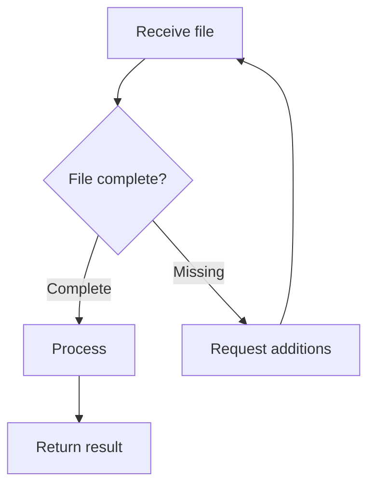

# Describing a process with tables and diagrams

Start from the source the user supplies (a regulation, a verbal description, an old procedure). You
can use it together with `office-documents` when writing a complete procedure document.

## Step table

| Step | Performer | What to do | Input / output | Hand over to |
|---|---|---|---|---|

One clear action per step. Branch conditions, exceptions and deadlines are recorded only when the
source has them. Where the source is missing something, write "needs confirmation" right at that step;
do not fill it yourself.

## RACI (when roles need assigning)

Build it only when the user wants responsibility made clear or the process crosses several departments.
Each step has exactly one final owner (A). Roles come from the source; do not add job titles.

## Diagram

Draw one only when asked, or when the process has branches that make the table hard to follow.
Choose the form by where it will be used:

- **Mermaid** for Markdown or pages that can render Mermaid. Word and many programs do not display it
  directly; when it must be pasted into Word, make an image or SVG.
- **SVG or a single HTML file** when it must be viewed offline or printed.

Put the labels in double quotes. Keep to about 12 nodes or fewer per diagram; split a long process
into an overview diagram and detail diagrams. If you can draw it and have a tool to check rendering,
look at the diagram once; if not, say it was not viewed on screen.

## Before delivering

Run one pass: there is a start and an end; every branch has an exit; loops (such as "supplement the
file") have a condition to leave; department names match the source. When the table and diagram are
delivered as requested, stop; do not propose process improvements unless asked.

Output example (fictional, only to picture the layout): `references/output-examples.md`. Open it when needed, not required.
For a whole procedure document with a code, sign-off, table of contents and a department organisation chart: `office-documents` (`references/procedure-document.md`).
