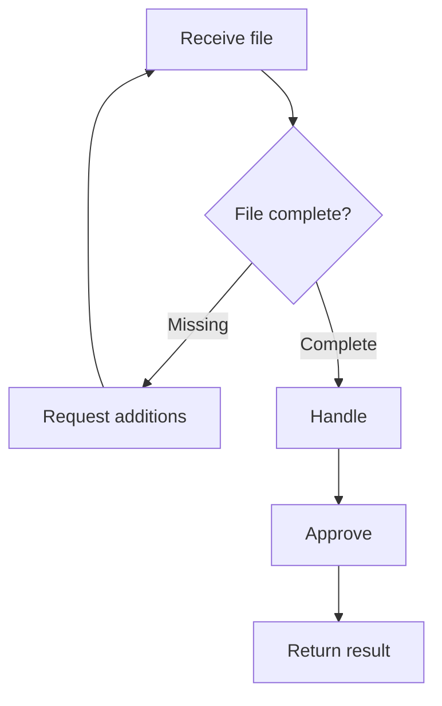

# Output example: step table, RACI and diagram

An illustration; content is fictional.

## Step table

| Step | Performer | What to do | Input / output | Hand over to |
|---|---|---|---|---|
| 1 | Reception | Receive and check the file | File / checked file | Step 2 |
| 2 | Reception | If incomplete: request additions; if complete: pass on for handling | File / supplement slip or complete file | The submitter (if incomplete) or Step 3 |
| 3 | Specialist | Handle the file | Complete file / draft result | Step 4 |
| 4 | Head of department | Approve (deadline: needs confirmation) | Draft / approved result | Step 5 |
| 5 | Reception | Return the result | Approved result / receipt | End |

## RACI (only when responsibility must be clear)

| Step | Reception | Specialist | Head of department |
|---|---|---|---|
| 1-2 | A, R | I | |
| 3 | I | A, R | C |
| 4 | I | C | A, R |
| 5 | A, R | I | I |

Each step has exactly one "A". Roles come from the source; do not add job titles.

## Diagram

## What to notice

Where the source does not say (the approval deadline) write "needs confirmation" at that very step; do not
fill it. The "supplement the file" loop has a way back and a condition to leave (when the file is complete).
