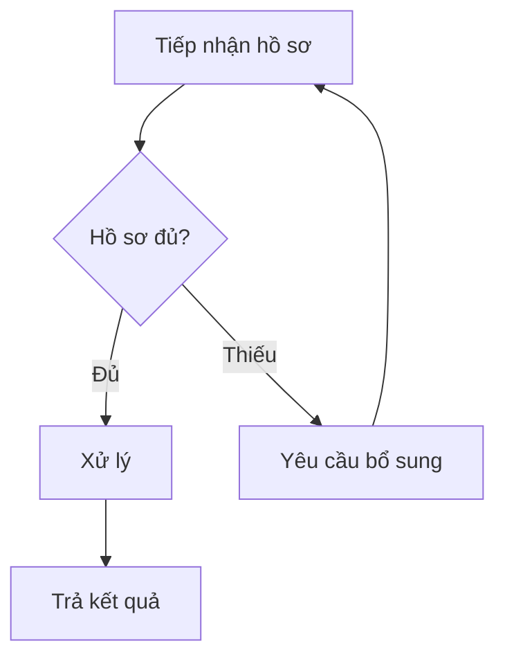

# Mô tả quy trình bằng bảng và sơ đồ

Bắt đầu từ nguồn do người dùng cung cấp (quy định, mô tả miệng, quy trình cũ). Có thể
dùng cùng `office-documents` khi viết thành tài liệu quy trình hoàn chỉnh.

## Bảng bước

| Bước | Người thực hiện | Việc cần làm | Đầu vào / đầu ra | Chuyển cho |
|---|---|---|---|---|

Mỗi bước một hành động rõ ràng. Điều kiện rẽ nhánh, ngoại lệ, thời hạn chỉ ghi khi nguồn
có. Chỗ nguồn còn thiếu thì ghi "cần xác nhận" ngay tại bước đó; không tự lấp.

## RACI (khi cần phân vai)

Chỉ lập khi người dùng muốn rõ trách nhiệm hoặc quy trình có nhiều bộ phận. Mỗi bước có
đúng một người chịu trách nhiệm cuối cùng (A). Vai trò lấy theo nguồn; không đặt thêm chức danh.

## Sơ đồ

Chỉ vẽ khi được yêu cầu hoặc khi quy trình có nhánh rẽ khiến bảng khó theo dõi.
Chọn dạng theo nơi dùng:

- **Mermaid** cho Markdown hoặc trang xem được Mermaid. Word và nhiều phần mềm không
  hiển thị trực tiếp; khi cần dán vào Word, tạo ảnh hoặc SVG.
- **SVG hoặc HTML một file** khi cần xem offline hoặc in.

Đặt nhãn tiếng Việt trong dấu nháy kép. Giữ khoảng 12 nút trở xuống mỗi sơ đồ; quy trình
dài thì tách thành sơ đồ tổng quan và sơ đồ chi tiết. Nếu vẽ được và có công cụ kiểm tra
hiển thị thì xem sơ đồ một lần; nếu không, nói rõ chưa xem trên màn hình.

## Trước khi giao

Rà một lượt: có điểm bắt đầu và kết thúc; mọi nhánh rẽ có lối ra; vòng lặp (như "bổ sung
hồ sơ") có điều kiện thoát; tên bộ phận khớp nguồn. Khi bảng và sơ đồ được giao theo yêu
cầu thì dừng; không đề xuất cải tiến quy trình nếu không được hỏi.

Ví dụ đầu ra (hư cấu, chỉ để hình dung cách trình bày): `references/output-examples.md`. Mở khi cần, không bắt buộc.
Khi cần cả tài liệu quy trình có mã, ký duyệt, mục lục và sơ đồ tổ chức của một phòng ban: `office-documents` (`references/procedure-document.md`).
