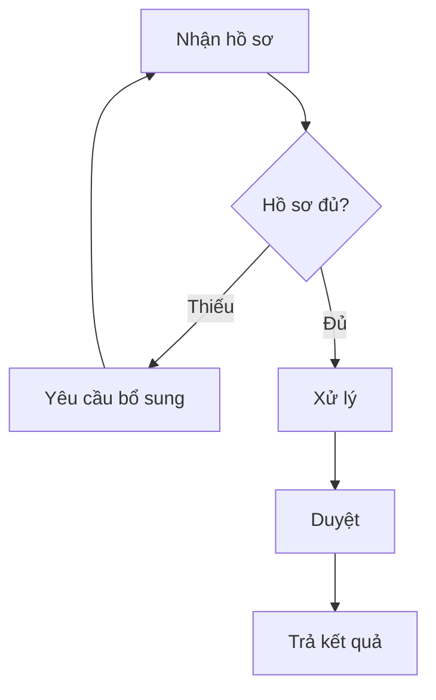

# Ví dụ đầu ra: bảng bước, RACI và sơ đồ

Ví dụ minh họa, nội dung hư cấu.

## Bảng bước

| Bước | Người thực hiện | Việc cần làm | Đầu vào / đầu ra | Chuyển cho |
|---|---|---|---|---|
| 1 | Bộ phận tiếp nhận | Nhận và kiểm tra hồ sơ | Hồ sơ / hồ sơ đã kiểm | Bước 2 |
| 2 | Bộ phận tiếp nhận | Nếu thiếu: yêu cầu bổ sung; nếu đủ: chuyển xử lý | Hồ sơ / phiếu bổ sung hoặc hồ sơ đủ | Người nộp (nếu thiếu) hoặc Bước 3 |
| 3 | Chuyên viên | Xử lý hồ sơ | Hồ sơ đủ / dự thảo kết quả | Bước 4 |
| 4 | Lãnh đạo phòng | Duyệt (thời hạn: cần xác nhận) | Dự thảo / kết quả đã duyệt | Bước 5 |
| 5 | Bộ phận tiếp nhận | Trả kết quả | Kết quả đã duyệt / biên nhận | Kết thúc |

## RACI (chỉ khi cần rõ trách nhiệm)

| Bước | Tiếp nhận | Chuyên viên | Lãnh đạo phòng |
|---|---|---|---|
| 1–2 | A, R | I | |
| 3 | I | A, R | C |
| 4 | I | C | A, R |
| 5 | A, R | I | I |

Mỗi bước có đúng một "A". Vai trò lấy theo nguồn; không đặt thêm chức danh.

## Sơ đồ

## Điểm cần chú ý

Chỗ nguồn chưa nêu (thời hạn duyệt) ghi "cần xác nhận" tại đúng bước, không tự lấp. Vòng "bổ sung hồ sơ"
có đường quay lại và có điều kiện thoát (khi hồ sơ đủ).
